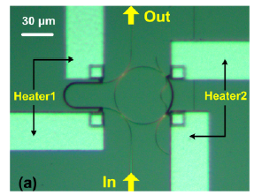
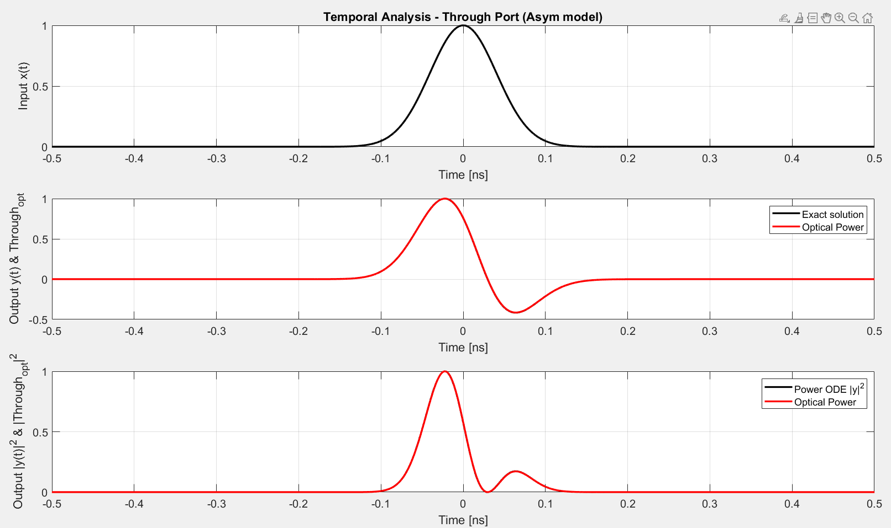
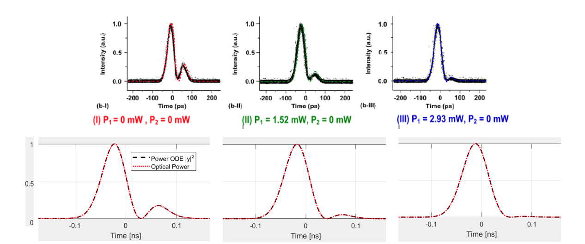
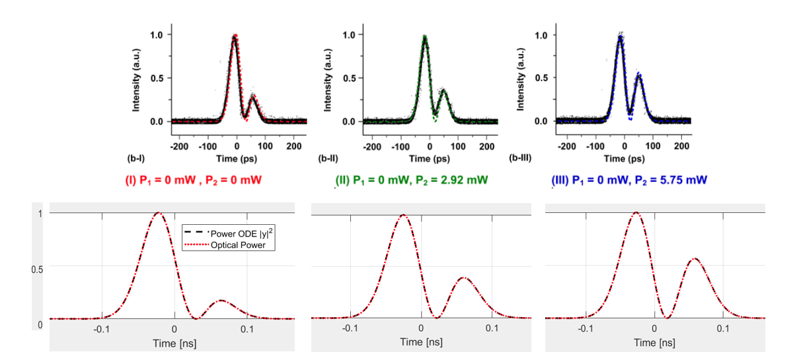
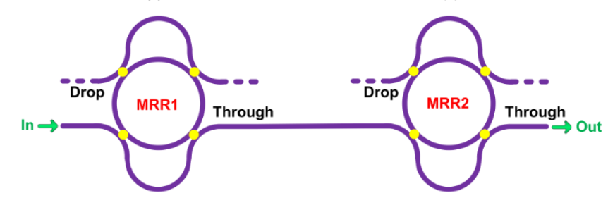

# $$\color{orange}{\text{Microring Resonators as analog processors - Photonic Project 2026}}$$
Run our project by clicking the following badge: 

## Microring resonators solving first-order liner ordinary differential equation

A first-order linear ODE can be represented as: 

 $$ \frac{\textrm{dy}\left(t\right)}{\textrm{dt}}+\textrm{ky}\left(t\right)=x\left(t\right) $$ 

By applying the *Fourier transform*, we can write the equation in the frequency domain:

 $$ H\left(\omega \right)=\frac{1}{k+j\omega } $$ 

The signal coming out from the drop port of a MRR, is described by the following equation:

 $$ H_{\textrm{dr}} \left(\omega \right)=\frac{k}{k+j\left(\omega -\omega_0 \right)} $$ 

As we can see, these two equations are strictly correlated.

The signal coming out from the drop port of a properly designed MRR, if scaled by $\frac{1}{k}$ , it can solve a first-order linear ODE with constant-coefficient valued as k.

In our code, we implemented a class called <samp>mrr.m</samp>, which models a microring resonator (that uses a drop-port as its output port) inside our matlab scripts.

Let's suppose, from a current driven RC circuit,  we want to find the equation that describes the voltage between the capacitance and the ground. A RC circuit is described by the following differential equation:

 $$ \frac{\textrm{dy}\left(t\right)}{\textrm{dt}}=\frac{1}{C}\left\lbrack -\frac{1}{R}y\left(t\right)+x\left(t\right)\right\rbrack $$ 

Where:

-  $y\left(t\right)$ is the voltage of the capacitance 
-  $x\left(t\right)$ is the input signal (current) 
-  $C$ is the capacitance 
-  $R$ is the resistance 

For simplicity, we give to ***C*** and ***R*** two made up values:

-  $\displaystyle C=1\textrm{nF}$ 
-  $\displaystyle R=16m\Omega$ 

From these data, we can model a MRR.

* Coupling-coefficient: $k$ = 1/R = 62.5 ns-1
* Effective index of SOI (Silicon On Insulator): $n_eff$ = 2.4
* Radius: 30 $\mu\text{m}$

Assumptions:

-  No chromatic dispersion: $n_g =n_{\textrm{eff}}$ 
-  Ideal case: $\alpha =0$ (no power line losses) 
-  $\displaystyle y\left(0\right)=0$ 

## Consideration on input bandwidth signal

We will consider the input signal $x\left(t\right)$ as a Gaussian impulse, described by the equation:

 $$ x\left(t\right)=\exp \left(-\log \left(2\right)*{\left(\frac{2t}{\textrm{FWHM}}\right)}^2 \right) $$ 

Choosing the value of the  **FWHM** is not trivial, since different values can heavily influence the output of the previously built MRR.

The FWHM controls the bandwidth of a Gaussian impulse:

 $$ B_{\textrm{in}} \propto\frac{1}{\textrm{FWHM}} $$ 

Now we introduce the definition of cavity lifetime:

 $\tau_c =\frac{1}{k}$ (for ODE)

For our MRR, this value is $\tau_c =16\;\textrm{ps}$ 

By comparing the magnitude of the cavity lifetime and the **FWHM** we can understand which behaviour our MRR will have.

### MRR as an Integrator - FWHM << cavity lifetime

If FWHM's order of magnitude is lower than the cavity lifetime, then our MRR can solve integrals of the input function.

From the equation that models the output of the drop port: 

 $$ H_{{\mathrm{d}\mathrm{r}}} \left(\omega \right)=\frac{k}{k+j\left(\omega -\omega_0 \right)} $$ 

If the bandwidth of the input signal is several order of magnitude bigger than the inverse of the cavity lifetime, the k parameter at the denominator becomes negligible:

 $$ H_{\textrm{dr}} \left(\omega \right)\cong \frac{k}{j\left(\omega -\omega_0 \right)} $$ 

The equation becomes: 

 $$ \frac{\textrm{dy}\left(t\right)}{\textrm{dt}}=x\left(t\right)\to y\left(t\right)=\int x\left(t\right)\;\textrm{dt} $$ 

So the solution of the equation, is the integral of the input.

### MRR as an Input scaler - FWHM >> cavity lifetime

If FWHM's order of magnitude is greater than the cavity lifetime, then our MRR will return a weighted replica (by $\frac{1}{k}$ ) of the input function.

From the equation that models the output of the drop port: 

 $$ H_{{\mathrm{d}\mathrm{r}}} \left(\omega \right)=\frac{k}{k+j\left(\omega -\omega_0 \right)} $$ 

If the bandwidth of the input signal is several order of magnitude smaller than the inverse of the cavity lifetime, the k parameter at the imaginary part of the denominator becomes negligible:

 $$ H_{\textrm{dr}} \left(\omega \right)\cong 1 $$ 

The solution will be:

 $$ k\cdot y\left(t\right)=x\left(t\right)\to y\left(t\right)=\frac{1}{k}\cdot x\left(t\right) $$ 

### MRR as an first-order linear ODE solver - FWHM with same order of magnitude  as cavity lifetime

If FWHM's order of magnitude is the same as the cavity lifetime, then our MRR can solve first-order linear ODE with a constant-coefficient $k$.

As we mentioned in the previous chapters, a first-order linear ODE is described by the following equation: 

 $$ \frac{\textrm{dy}\left(t\right)}{\textrm{dt}}+k\cdot y\left(t\right)=x\left(t\right) $$ 

After having applied the Fourier Transform, we obtain:

 $$ H\left(\omega \right)=\frac{1}{k+j\omega } $$ 

Which is equal to the equation at the drop port of a correctly built MRR:

 $$ H_{\textrm{dr}} \left(\omega \right)=\frac{k}{k+j\omega }=k\cdot H\left(\omega \right) $$ 

By comparing the power spectrum of the Ideal ODE (blue) with the one of the MRR (red), we can see a perfect match - meaning that our microring resonator can solve almost perfectly the problem's ODE.

 

## Considerations on Root Mean Square Error & Power consumed

The RMSE of the output is: 0.00020253  
While the power consumed is: -7.05865e-12 W (-3dB)  

## Changing equation's parameter
### Non-tunable Microring Resonator

With a non-tunable MRR, if the equation changes, we can observe that the RMSE (between the measured solution and the correct one) starts to grow as we get further from the k parameter of the ring.

While the power consumed by the architecture remains constant, since it depends by the geometry of the microring.

In order to create a photonic chip that is able to solve - with a low RMSE - different first-order linear ODEs by using the microring resonators we have two options:

1.   Build a chip with as many MRRs as are the equation we want to solve. This solution is not pheasibile, since it is very inefficient in terms of footprint occupied on the chip and also in terms of costs.
2. Find a way to tune the k parameter of the MRR. This is the idea introduced by the paper *"All-optical differential equation solver with constant-coefficient tunable based on a single microringresonator – Yang et al."*
### Tunable Microring resonator

 In the aforementioned paper, they demonstrated that by injecting a voltage on the MRR you can change the refractive index and the absorption coefficient of a silicon waveguide - this phenomenom was demonstrated by Soref and Benned in 1987 in the paper "Electrooptical Effects in Silicon".

From this changes, it follows a change in the Quality factor (***Q***) defined as:

 $$ Q=\frac{\omega_0 }{2k} $$ 

Therefore, we can tune the k coefficient of the microring resonator.

The paper reports the voltage values applied to the MRR and their associated k-coefficients. However, it does not provide an explicit function relating voltage to k. To address this, we interpolated the known data points from 0 V to 0.9 V using a second-degree polynomial, while the remaining points were connected using linear interpolation.

The authors also report the presence of the blue-shift phenomenon; the 3dB bandwidth increases as the voltage increases.

As we can see from the following graph, the RMSE is lower inside the interval of the coupler-coefficient values of the paper while starts to increase as it gets away from the interval endpoints.

Differently from the previous case, the power consumed changes since we are tuning the coupler-coefficient value $k$. 
Note: outside of the interval endpoints, we can see that the power consumed is constant since we assumed that $k$ cannot reach those values.

## Phase detuning

The system's performance is highly dependent on the phase detuning $\Delta f$ . In the absence of chromatic dispersion, introducing a detuning that is an exact multiple of the Free Spectral Range (FSR) — coinciding with a resonant frequency — yields no noticeable deviation from the ideal behavior. Under this condition, the device operates efficiently, consuming only half of the input power with a negligible RMSE.  Conversely, operating away from resonance leads to a significant degradation in performance. This degradation peaks at a detuning of $\frac{\textrm{FSR}}{2}$ . 

In this worst-case scenario, the system experiences maximum attenuation, consuming virtually all the available input power (roughly 99.80% power consumption), which severely attenuates the output signal and increases the error.

  

## Extension to N-th order

## LTI Equation
The system can be described by the following differential equation:

$$\frac{dy(t)}{dt} + a_0 y(t) = b_1 \frac{dx(t)}{dt} + b_0 x(t)$$

### Frequency Domain Representation
By applying the Fourier transform, we can write the equation in the frequency domain as:

$$H(\omega) = \frac{b_1 j\omega + b_0}{j\omega + a_0}$$

### MRR Through Port
The transfer function at the MRR Through Port is proportional to:

$$H_{tr}(\omega) \propto \frac{j\omega + b_0 / b_1}{j\omega + a_0}$$

> **Note:** Moreover, the $b_1$ parameter will be always equal to $1$ for a single MRR

# Problem as a First Order LTI System

## Circuit: Passive Lead-Lag Network ($R_1 \parallel C$ in Series, $R_2$ to Ground)

Given a passive lead-lag RC network consisting of a resistor $R_1$ in parallel with a capacitor $C$, connected between the input node and the output node, followed by a resistor $R_2$ connecting the output node to ground. 

## Diagram
[Lead-lag network circuit diagram]

## Mathematical Model

The circuit is described by the following first-order Linear-Time-Invariant (LTI) differential equation:

$$\frac{dv_o(t)}{dt} + \frac{R_1 + R_2}{C R_1 R_2} v_o(t) = \frac{dv_i(t)}{dt} + \frac{1}{R_1 C} v_i(t)$$

Where:
* **$v_o(t)$** is the voltage we want to measure (output voltage)
* **$v_i(t)$** is the input signal (input voltage)
* **$R_1, R_2$** are the resistances
* **$C$** is the capacitance

For simplicity, we assign the following component values:
* $C = 1 \text{ pF}$
* $R_1 = 101,5 \Omega$
* $R_2 = 15 \Omega$

From these data, we can model the problem introducing a novel Microring Resonator (MRR).

In our code, we implemented a class called <samp>mrr_asym.m</samp>, which models a microring resonator that uses the through-port as its output port.

## Assumptions
* **Paper case:** $\alpha = 8  dB/cm $ 
* **Initial condition:** $v_o(0) = 0 $

## Diagram
Novel model of our MRR

---

## Solving the Previous Problem

Let's tune the parameters:
* $P1 = 0 \text{ mW}$
* $P2 = 0 \text{ mW}$

Which translates into the following equation:

$$\frac{dy(t)}{dt} + a_0 y(t) = \frac{dx(t)}{dt} + b_0 x(t), \quad y_0 = 0$$

Providing the following parameter values:
* $a_0 = 7.6622 \cdot 10^{10} \text{ s}^{-1}$
* $b_0 = 9.8448 \cdot 10^9 \text{ s}^{-1}$

---

## Simulation Results

### Temporal Analysis - Through Port (Asym model)

The plots above show the temporal analysis results:
1. **Input Signal $x(t)$**: A Gaussian input pulse centered at $t = 0 \text{ ns}$.
2. **Output $y(t)$ & Through Port Optical Power**: The exact solution tracking the optical power waveform.
3. **Output $|y(t)|^2$ & $|\text{Through}_{\text{opt}}|^2$**: The squared magnitude comparing the Power ODE solution against the simulated optical power.

# Tuning the Coefficient Through the Heaters

By utilizing integrated microheaters, we can dynamically tune the coefficients of our microring resonator (MRR) solver. Due to the absence of explicit fabrication, we characterize this tuning via a **power efficiency value** that accurately models the **thermo-optic effect** (where localized temperature changes shift the refractive index and introduce phase modifications).

---

## Part 1: Tuning Heater 1 ($P_1$)

In the first set of tests, power is applied incrementally to $P_1$ while keeping $P_2$ completely deactivated ($0\text{ mW}$). This configuration allows us to observe the progressive suppression and restructuring of the secondary peak response.

### Tuning Configurations (Set 1)

| Configuration | Heater Power 1 ($P_1$) | Heater Power 2 ($P_2$) |
| :--- | :--- | :--- |
| **Case I (Red)** | $0 \text{ mW}$ | $0 \text{ mW}$ |
| **Case II (Green)** | $1.52 \text{ mW}$ | $0 \text{ mW}$ |
| **Case III (Blue)** | $2.93 \text{ mW}$ | $0 \text{ mW}$ |

### Experimental vs. Simulation Results (Set 1)

Heater 1 Tuning Analysis

* **Top Row (Experimental/Reference Data):** Shows the measured temporal intensity profiles in picoseconds ($\text{ps}$) across the three different tuning power states (b-I, b-II, and b-III).
* **Bottom Row (Model Verification):** Displays the corresponding simulated response in nanoseconds ($\text{ns}$). The **Power ODE $|y|^2$** numerical model (dashed black line) shows an excellent fit with the simulated **Optical Power** (dotted red line).

---

## Part 2: Tuning Heater 2 ($P_2$)

In the second set of tests, $P_1$ is kept turned off ($0\text{ mW}$) while the power applied to $P_2$ is steadily increased up to $5.75\text{ mW}$. This asymmetrical change induces a distinct morphological shift, notably accentuating and widening the secondary waveform peak over time.

### Tuning Configurations (Set 2)

| Configuration | Heater Power 1 ($P_1$) | Heater Power 2 ($P_2$) |
| :--- | :--- | :--- |
| **Case I (Red)** | $0 \text{ mW}$ | $0 \text{ mW}$ |
| **Case II (Green)** | $0 \text{ mW}$ | $2.92 \text{ mW}$ |
| **Case III (Blue)** | $0 \text{ mW}$ | $5.75 \text{ mW}$ |

### Experimental vs. Simulation Results (Set 2)

Heater 2 Tuning Analysis

* **Top Row (Experimental/Reference Data):** Shows the measured temporal intensity profiles in picoseconds ($\text{ps}$) under $P_2$ tuning control (b-I, b-II, and b-III).
* **Bottom Row (Model Verification):** Displays the corresponding simulated response in nanoseconds ($\text{ns}$). The **Power ODE $|y|^2$** prediction tracks the simulated **Optical Power** baseline flawlessly, validating our thermo-optic efficiency approximation under alternative asymmetrical loads.

# Second Order LTI ODE Solver

The previous first-order ODE solver configuration can be extended to solve higher-order differential equations by cascading multiple add-drop microring resonators (MRRs) with tunable interferometric couplers.

## System Diagram

Cascaded MRR Second Order Solver

*Schematic illustration of the second-order ODE solver implemented by two cascaded add-drop MRRs with interferometric couplers – Image taken from the paper «Compact tunable silicon photonics differential-equation solver for general linear time-invariant systems» - Wu et al.*

---

## Mathematical Model

Assuming two cascaded add-drop MRRs share the exact same resonance wavelength, the system behavior simplifies to a second-order LTI differential equation:

$$\frac{d^2y(t)}{dt^2} + a_1 \frac{dy(t)}{dt} + a_0 y(t) = \frac{d^2x(t)}{dt^2} + b_1 \frac{dx(t)}{dt} + b_0 x(t)$$

### Transfer Function
The cumulative system transfer function is the product of the individual MRR stages:

$$H_{out} = H_{MRR1} \cdot H_{MRR2} = \frac{b_0 + jb_1\omega - \omega^2}{a_0 + ja_1\omega - \omega^2}$$

Where the system coefficients map to the individual stage coefficients as follows:
* $a_0 = a_{10} a_{20}$
* $a_1 = a_{10} + a_{20}$
* $b_0 = b_{10} b_{20}$
* $b_1 = b_{10} + b_{20}$

---
>Project developed by: _Alankar Gupta, Marco Melzi, Matteo Piacentini_
